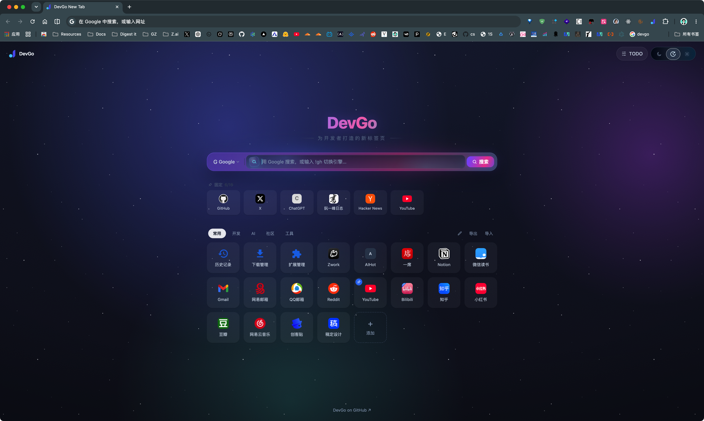

# DevGo

DevGo 是一个面向开发者的浏览器效率扩展，聚焦翻译、GitHub 增强、新标签页效率工具、网络调试辅助和页面资源处理。

下载插件：👉🏻 [Chrome 应用商店的链接](https://chrome.google.com/webstore/detail/devgo/kcofdbjhicjdbmldlcffcijglkifnnjn)

源码仓库：👉🏻 [GitHub](https://github.com/wangrongding/dev-go)

## 打开方式与快捷键

| 操作            | 默认快捷键 | 说明                                            |
| --------------- | ---------- | ----------------------------------------------- |
| 打开 DevGo 面板 | `Alt+1`    | 打开后进入「功能」页配置的默认 Tab              |
| 打开待办面板    | `Alt+2`    | 直接定位到 Popup 的「待办」Tab                  |
| 打开网络面板    | `Alt+3`    | 直接定位到 Popup 的「网络」Tab                  |
| 打开资源面板    | `Alt+4`    | 直接定位到 Popup 的「资源」Tab                  |
| 整页行间翻译    | 未默认绑定 | 可在 `chrome://extensions/shortcuts` 手动设置   |
| GitHub 在线编辑 | `,`        | 在 GitHub 代码页打开 github1s，输入框内不会触发 |

快捷键可以在 Chrome 的扩展快捷键页面重新绑定。Mac 上 `Alt` 会显示为 `Option`。

## Popup 面板

点击扩展图标或使用快捷键打开 Popup。当前面板包含「翻译、待办、网络、资源、功能」五个 Tab。

### 翻译

- 查词支持有道、微软、Google。有道结果包含音标、释义和发音链接，微软和 Google 会返回译文与词典释义。
- 整页翻译会在原文下方插入译文，再次点击可以移除译文并恢复页面。
- 整页翻译引擎支持微软和 Google。微软默认可直连，Google 适合网络环境可访问时使用。
- 翻译内容会在后台做批处理和缓存，减少重复请求。

### 划词翻译

- 在网页中选中文本后会显示「译」按钮，点击后展示翻译气泡。
- 选中单个英文单词时，会同时展示词典释义，并提供朗读和复制译文。
- 可在「功能」Tab 关闭或开启划词翻译。

### 待办

- Popup 待办页适合快速记录任务，支持「待办、进行中、已完成」三种状态。
- 点击任务左侧状态圆点可循环切换状态。
- 支持筛选、编辑、删除、拖拽排序，以及 JSON 导入导出。
- 待办数据和新标签页 TODO 看板共用同一份同步存储。

### 网络

网络面板提供四种模式：

- 直连：不使用代理。
- 系统代理：跟随浏览器或系统代理设置。
- 代理模式：全部流量走固定代理服务器，默认示例为 `127.0.0.1:7890`。
- 情境模式：可下载 AutoProxy/GFWList 规则，命中规则走代理，未命中直连；未启用规则时按代理模式处理。

网络面板还支持：

- HTTP、HTTPS、SOCKS4、SOCKS5 代理协议。
- 代理绕过列表，每行一个域名或 Chrome 代理绕过规则。
- 一键将当前站点加入或移出直连列表。
- 切换代理后自动刷新当前页面。
- 本地开发用 CORS 辅助，为网页 XHR/fetch 响应补充跨域响应头。

::: warning
CORS 辅助只适合本地开发调试。它不能修复服务器拒绝 `OPTIONS`、带凭证请求、CSP 或混合内容限制，开关切换后通常需要刷新页面。
:::

### 资源

资源面板用于处理当前标签页中的媒体资源：

- 从网络请求和页面 DOM 中收集图片、视频资源。
- 支持按全部、图片、视频筛选，也可以按文件名、域名、URL、MIME 类型搜索。
- 单个资源支持预览视频、复制链接、打开链接和下载。
- 支持批量下载筛选后的可下载资源，默认保存到 `DevGo-Media` 目录。

### 功能

功能页用于管理全局设置：

- 设置 `Alt+1` 打开面板时默认进入的 Tab。
- 开关划词翻译和 GitHub 增强。
- 查看当前注册的快捷键，并跳转到浏览器快捷键管理页。
- 导出或导入 DevGo 全量配置，包括翻译设置、网络设置、快捷导航、分类名称、主题和待办。

## 新标签页

DevGo 新标签页包含搜索、快捷导航、主题和 TODO 看板。

### 搜索

- 可切换 Google、百度、Bing、npm、GitHub、MDN、Stack Overflow。
- 支持 bang 语法临时切换搜索引擎，例如 `!gh react` 使用 GitHub 搜索。
- 输入 URL 或域名时会直接跳转，不走搜索引擎。
- 搜索联想会聚合快捷导航和浏览器书签，支持键盘上下选择。

### 快捷导航

- 默认按「常用、开发、AI、社区、工具」分类组织站点。
- 支持新增、编辑、删除、拖拽排序。
- 支持固定常用站点到搜索框下方，固定栏最多 6 个。
- 分类名称可以重命名，配置可导出和导入。
- 新版本会自动补齐历史记录、下载管理和扩展管理等浏览器内建入口。

### TODO 看板

- 点击新标签页右上角 `TODO` 打开看板。
- 看板按「待办、进行中、已完成」分列展示。
- 支持拖拽任务跨列移动，和 Popup 待办页实时共享数据。

### 主题

- 主题支持自动、浅色、深色。
- 自动模式会按本地时间在 18:00 到 06:00 使用深色，其余时间使用浅色。

## 页面增强

### GitHub 增强

- 在 GitHub 代码页右下角显示浮动按钮。
- 支持打开 github1s 在线编辑、打开 DeepWiki、回到页面顶部。
- 支持快捷键 `,` 直接打开 github1s。
- 可在「功能」Tab 关闭或开启。

### 浏览器自带翻译优化

DevGo 会为代码块、表单、导航、GitHub 等场景中不适合翻译的元素添加 `notranslate` 标记，减少浏览器自带整页翻译误翻代码、按钮和导航文本的情况。

### 外链直达

访问掘金、知乎、简书的外链中转页时，DevGo 会解析目标地址并直接跳转，减少手动确认步骤。

### 复制限制解除

DevGo 会尝试解除部分站点对复制、剪切和文本选择的限制，降低网页附加版权信息或禁止选择文本带来的干扰。

## 数据同步与备份

- 新标签页导航、主题、搜索引擎、待办和默认面板 Tab 使用同步存储，登录浏览器账号后可跨设备同步。
- 网络代理接管状态保存在本机，导入备份后需要在网络面板重新确认是否应用代理。
- 旧版本存放在本机的导航、待办、主题和搜索引擎会在打开 Popup 或新标签页时自动迁移到同步存储。

## 贡献

欢迎提 Issue 和 PR，共同完善 DevGo。
